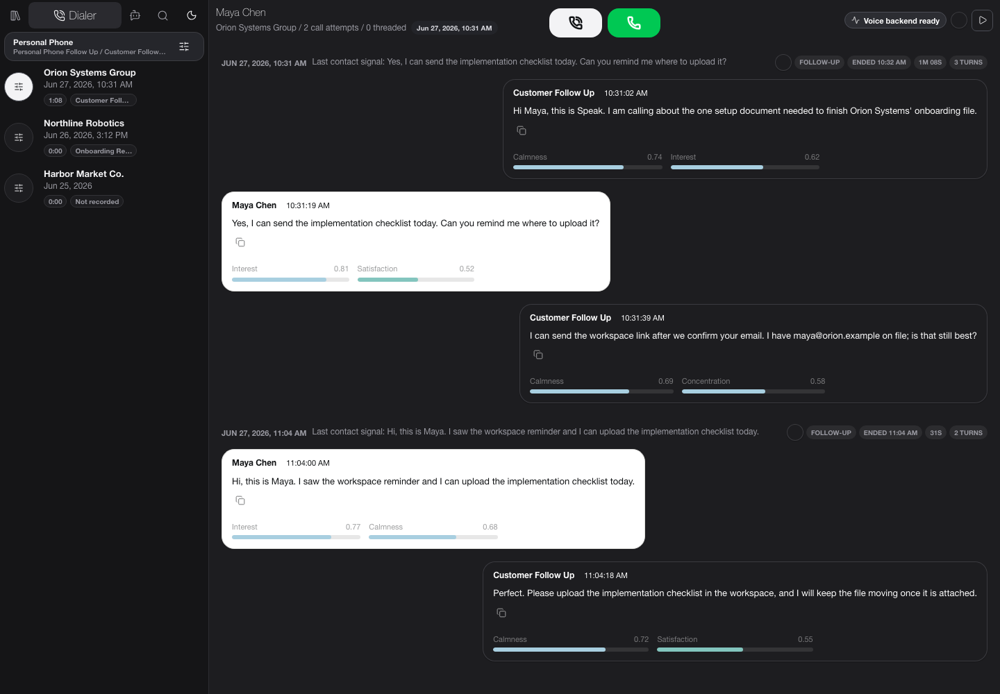

<p align="center">
  <picture>
    <source media="(prefers-color-scheme: dark)" srcset="docs/assets/speak-wordmark-dark.png">
    
  </picture>
</p>

<p align="center"><strong>Operator-first voice-agent operations for live calls.</strong></p>

<p align="center">
  <a href="https://files.split-llc.com/speak/">Product & docs</a> ·
  <a href="docs/agent-integration.md">Agent integration</a> ·
  <a href="docs/backend-api-reference.md">API reference</a> ·
  <a href="docs/voice-provider-integration.md">Provider guide</a>
</p>

# Speak

Speak is an open-source operations workspace for voice agents. It keeps the contact queue, live transcript, agent configuration, communication history, human supervision, and proof-backed actions in one surface so an automated call does not become a black box.

The project is designed for high-trust outbound workflows where an operator needs to see what the agent knows, guide it while a call is active, take over when needed, and verify actions such as messages or contact updates after they run.



## What it includes

- **Library** — contacts, Smart Views, source imports, agent profiles, recordings, communication threads, and contact-scoped memory.
- **Dialer** — queue control, live transcripts, call state, playback, operator takeover, and live agent guidance.
- **Playground** — prompt and voice configuration, browser tests, phone-quality tests, provider options, and reusable agent profiles.
- **Human supervision** — Spy, Whisper, and Barge flows for supported phone transports.
- **Unified communication history** — calls, SMS, email, recordings, provider events, and tool proof normalized into durable threads.
- **Multiple realtime voice runtimes** — Hume, Inworld, and xAI Voice Agent integrations, with Telnyx and CallTools phone transports.
- **Portable agent contract** — MCP/ChatGPT Apps, MCP UI, OpenAPI, ACP, A2A discovery, AG-UI, A2UI, Vercel AI SDK/JSON Render, CopilotKit, and portable host/widget manifests generated from one backend-owned contract.
- **Proof-preserving actions** — live-world actions fail closed and surfaces only claim success when the backend returns evidence.

## Architecture

```text
React / TypeScript operator UI
          │
          ▼
Express API + shared action contract
   ┌──────┼──────────┬───────────────┐
   ▼      ▼          ▼               ▼
voice   phone     workspace       agent / UI
runtime transport   store          adapters
   │      │          │               │
Hume   Telnyx     contacts        MCP / OpenAPI
Inworld CallTools  threads         widgets / A2A
xAI               memory          host clients
```

The browser app and agent surfaces use the same backend action definitions. That keeps authorization, proof, and state semantics aligned instead of duplicating behavior in each integration.

## Run locally

Requirements: Node.js 22+ and npm.

```bash
git clone https://github.com/jacob-split/speak.git
cd speak
npm ci
cp .env.example .env
npm run dev
```

The UI and API start together. Provider credentials are optional for browsing the app and running non-live checks; configure only the runtimes and transports you intend to use. Secrets remain server-side.

Useful commands:

```bash
npm run lint
npm run build
npm run qa:backend-api
npm run qa:agent-readiness
npm run qa:communication-threads
npm run qa:ui-contract
```

Provider-specific live checks are intentionally separate from the normal build and require explicit configuration.

## Configuration

Start with `.env.example`. The main integration groups are:

| Area | Common variables |
| --- | --- |
| Hume | `HUME_API_KEY`, `HUME_CONFIG_ID`, `HUME_VOICE_ID` |
| Inworld | `INWORLD_API_KEY`, `INWORLD_CONFIG_ID` |
| xAI Voice Agent | `XAI_API_KEY` |
| Telnyx | `TELNYX_API_KEY`, connection/number IDs, webhook verification keys |
| CallTools | `CALLTOOLS_API_KEY`, campaign/phone gateway settings |
| Workspace email | `WORKSPACE_EMAIL_ACCOUNT` and optional read/send broker identities |
| Agent surfaces | base/public URL and MCP/adapter options |

See [Configuration options](docs/configuration-options.md) for the full reference and [Voice provider integration](docs/voice-provider-integration.md) for adding another speech-to-speech runtime.

## Agent and application surfaces

Speak exposes a machine-readable contract rather than hand-maintaining separate integrations. Relative to the configured app base path, notable surfaces include:

- `/mcp`
- `/api/agent/capabilities`
- `/api/agent/openapi.json`
- `/api/agent/acp`
- `/api/agent/readiness.json`
- `/.well-known/agent-card.json`
- `/api/agent/generative-ui.json`
- `/api/agent/ui-adapter-kit.json`
- `/api/agent/ui-snapshot.json`

See [Agent integration](docs/agent-integration.md), [Agent reference](docs/agent-reference.md), and [Generative UI widgets](docs/generative-ui-widgets.md).

## Documentation and screenshots

The public product/docs site is https://files.split-llc.com/speak/. Checked-in screenshots are generated only from synthetic fixtures; real contacts, phone numbers, call logs, credentials, and provider IDs are never used in documentation captures.

- [UI reference](docs/ui-reference.md)
- [Backend API reference](docs/backend-api-reference.md)
- [Communication thread model](docs/communication-thread-model.md)
- [Configuration options](docs/configuration-options.md)
- [Voice provider integration](docs/voice-provider-integration.md)
- [Branding and UI guidelines](BRANDING.md)

## Maintenance utilities

State repairs are dry-run first and require a separate apply command. Notable integrity helpers include `npm run repair:communication-source-dedup` and `npm run repair:default-off-inbound-calls`; review their output before using the corresponding `:apply` command.

## Security model

Provider keys and phone credentials stay on the backend. Webhook signatures are verified when enabled, high-risk actions carry explicit authorization modes, and action invocations return structured proof instead of optimistic UI success. Do not commit `.env`, workspace data, recordings, credentials, or production exports.

Report vulnerabilities privately as described in [SECURITY.md](SECURITY.md).

## Contributing

Issues and pull requests are welcome. Keep changes scoped, preserve the shared action contract, use synthetic fixtures for tests/docs, and run the relevant checks before submitting. See [CONTRIBUTING.md](CONTRIBUTING.md).

## License

Apache-2.0. See [LICENSE](LICENSE).
